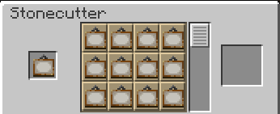
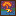
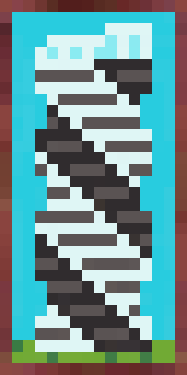
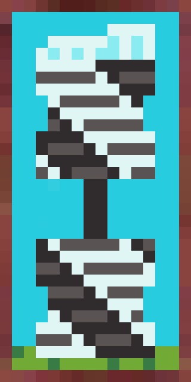
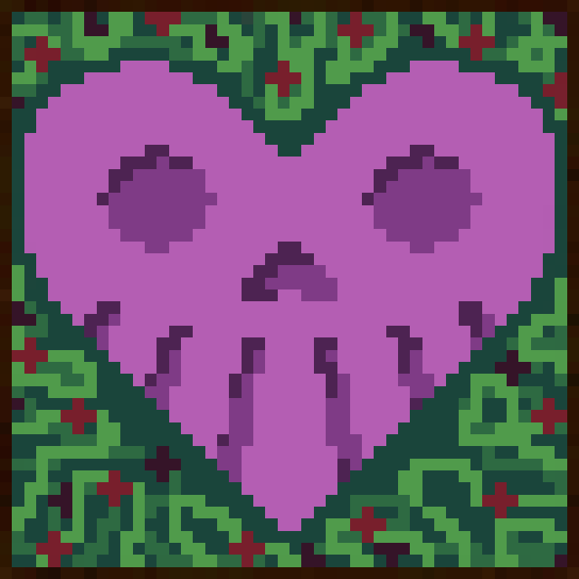
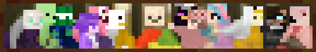
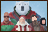
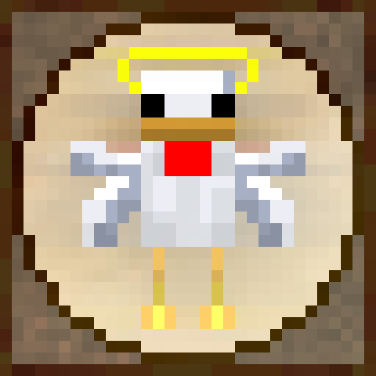
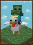

# Custom Paintings

A bunch of new painting related to the community have been added to the pool of possible paintings. Due to the pool of painting bringing additional rng element, you can use the Stonecutter to choose which painting you want without any rng element:

<figure><figcaption></figcaption></figure>

### List of Paintings By Author:

DDay Skeleton

|        Name        | Size |                Image                |
| :----------------: | :--: | :---------------------------------: |
|  Chuck's Ultimatum |  1x1 |       |
|       Slinky       |  2x1 |      |
|    Sly's Revenge   |  2x1 |  |
| Violent Overgrowth |  3x3 |    |

Ben Cactux

|             Name            | Size |                  Image                 |
| :-------------------------: | :--: | :------------------------------------: |
|          I’m Cubic          |  2x2 |       |
|       The Last Supper       |  1x5 |    |
| Did We Just Save Christmas? |  2x3 |        |
|      The Vitruvian Kev      |  2x2 |  |

Frodo Tim Baku

|   Name   | Size |                  Image                  |
| :------: | :--: | :-------------------------------------: |
| Holy Duo |  4x3 |  |

