# Custom Recipes

Any recipe can be looked at in game by using <mark style="color:purple;">**/recipe**</mark>

## Woodcutter:

Various wood items can now be crafted through Stonecutter.




<figure>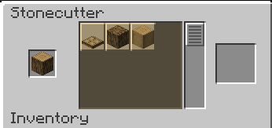<figcaption></figcaption></figure> <figure>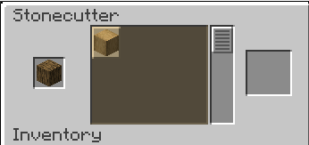<figcaption></figcaption></figure> <figure>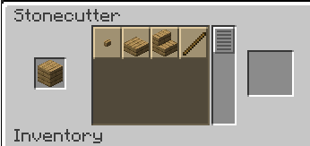<figcaption></figcaption></figure>





<figure>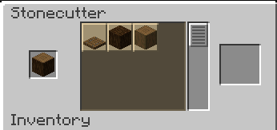<figcaption></figcaption></figure> <figure>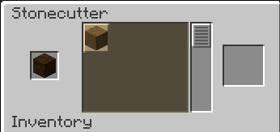<figcaption></figcaption></figure> <figure>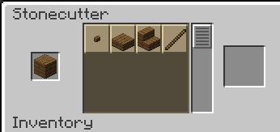<figcaption></figcaption></figure>





<figure>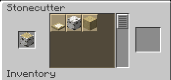<figcaption></figcaption></figure> <figure>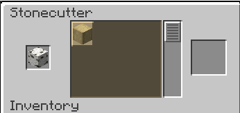<figcaption></figcaption></figure> <figure>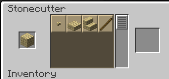<figcaption></figcaption></figure>





<figure>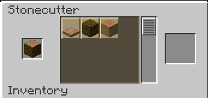<figcaption></figcaption></figure> <figure><figcaption></figcaption></figure> <figure><figcaption></figcaption></figure>





<figure>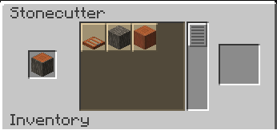<figcaption></figcaption></figure> <figure>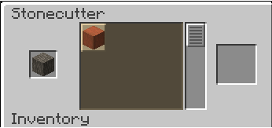<figcaption></figcaption></figure> <figure>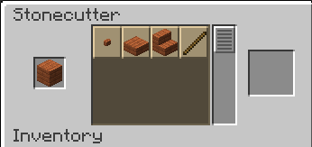<figcaption></figcaption></figure>





<figure>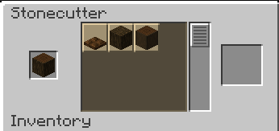<figcaption></figcaption></figure> <figure>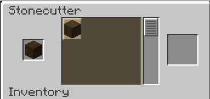<figcaption></figcaption></figure> <figure>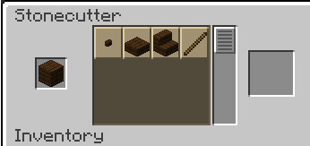<figcaption></figcaption></figure>





<figure>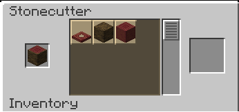<figcaption></figcaption></figure> <figure>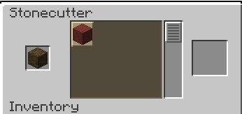<figcaption></figcaption></figure> <figure>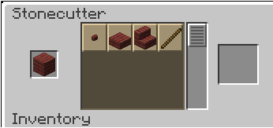<figcaption></figcaption></figure>





<figure>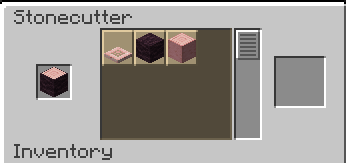<figcaption></figcaption></figure> <figure>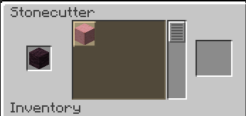<figcaption></figcaption></figure> <figure>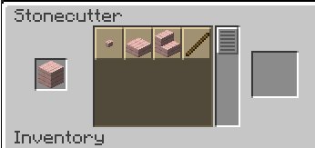<figcaption></figcaption></figure>





<figure>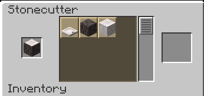<figcaption></figcaption></figure> <figure>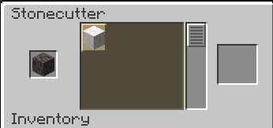<figcaption></figcaption></figure> <figure>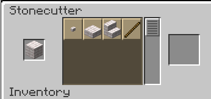<figcaption></figcaption></figure>





<figure>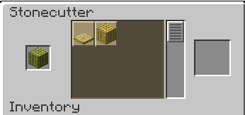<figcaption></figcaption></figure> <figure>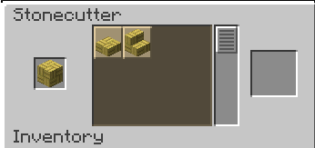<figcaption></figcaption></figure> <figure>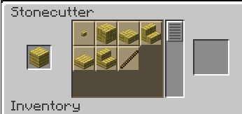<figcaption></figcaption></figure>





<figure>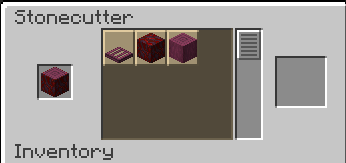<figcaption></figcaption></figure> <figure>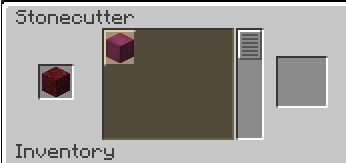<figcaption></figcaption></figure> <figure>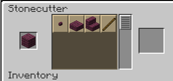<figcaption></figcaption></figure>





<figure>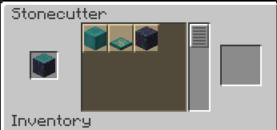<figcaption></figcaption></figure> <figure>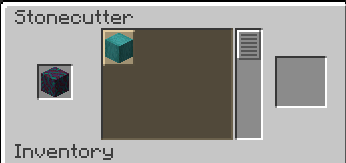<figcaption></figcaption></figure> <figure>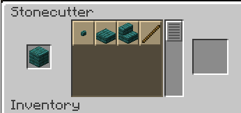<figcaption></figcaption></figure>




## Other Stonecutter changes:

Additions to the copper block recipes in stonecutter have been expanded to include doors and trapdoors.

Works with all versions of the copper block.

<figure>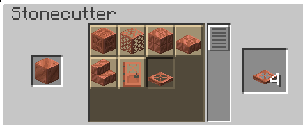<figcaption></figcaption></figure> <figure>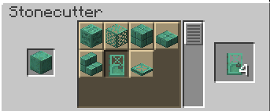<figcaption></figcaption></figure>

## Non-Renewables:

Recipes that were added to bring a way for players to be able to obtain items which were limited indefinitely.




<figure>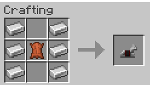<figcaption></figcaption></figure> <figure>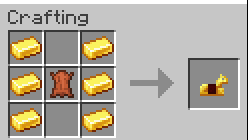<figcaption></figcaption></figure> <figure>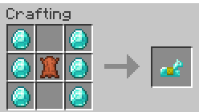<figcaption></figcaption></figure>





<figure>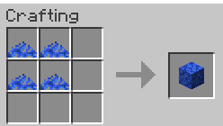<figcaption></figcaption></figure> <figure>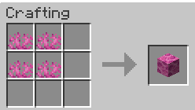<figcaption></figcaption></figure> <figure>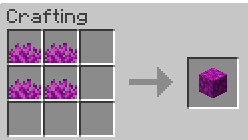<figcaption></figcaption></figure> <figure>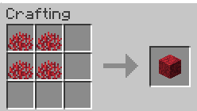<figcaption></figcaption></figure> <figure>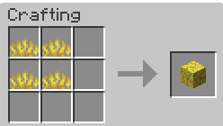<figcaption></figcaption></figure>




<figure>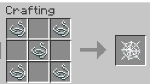<figcaption></figcaption></figure>



<figure>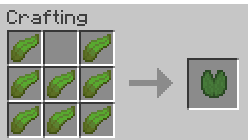<figcaption></figcaption></figure>



<figure>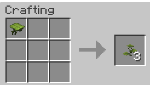<figcaption></figcaption></figure>



<figure>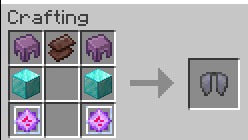<figcaption></figcaption></figure>



<figure>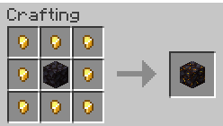<figcaption></figcaption></figure>



<figure>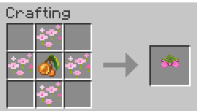<figcaption></figcaption></figure>



## Custom Horns:

Recipes which bring new life to the horns by adding the ability to craft horns with new sounds.

**Recipe Example:**

<figure><figcaption></figcaption></figure>

For more details on the Custom Horns, look into [Custom Horns](custom-horns.md)

## Custom Trims:

Trans Star Recipe which is used as a brand new material option for the Trims.

<figure><figcaption></figcaption></figure>

To learn more about the trims visit page about [Custom Trims](custom-trims.md)

## Other:

Other custom recipes on the AtriocSMP



<figure><figcaption>
*The Book &#x26; Quill will not keep the text from the written book, used in the recipe*
</figcaption></figure>



<figure><figcaption>
*Drag onto an enchanted item to remove 1 random enchantment from it, consumed on use*
</figcaption></figure>



