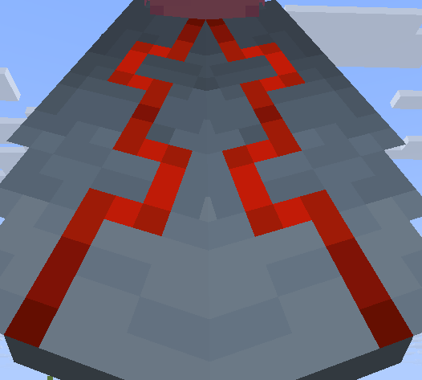
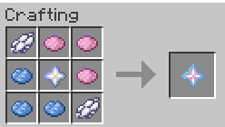

# Custom Trims

The AtriocSMP has multiple changes regarding the trim mechanic.&#x20;

List of all the mechanics can be found futher down below.

## Tester Pack:

If you wish to test these trims out before you decide to make them on the smp, here you can download a tester datapack and resource pack to try out these trims in your singleplayer world.


Datapack



Resource pack


#### How to Install the Tester Pack:

First place the Resource pack (asmp\_trims\_resources.zip) into:\
C:\Users\\<mark style="color:$success;">"</mark>_<mark style="color:$success;">**PC Name**</mark>_<mark style="color:$success;">"</mark>\AppData\Roaming.minecraft\resourcepacks

Secondly place the Datapack (asmo\_trims.zip) into:\
C:\Users\\<mark style="color:$success;">"</mark>_<mark style="color:$success;">**PC Name**</mark>_<mark style="color:$success;">"</mark>\AppData\Roaming.minecraft\saves\\<mark style="color:$success;">"</mark>_<mark style="color:$success;">**World Name**</mark>_<mark style="color:$success;">"</mark>\datapacks

After than you just need to restart your world  and choose the resource pack in your settings.\
The pack should then be working.

While in creative mode, you are able to open up custom menus to generate items with the trims:

<figure><figcaption></figcaption></figure>

When choosing the colored option it will look at what color you chose, if you choose the base version it ignores the color and gives you the base item look with the trim chosen.

## New Trimable Items:

You can now trim more items!

_<mark style="color:$danger;">**\*Disclaimer\***</mark>**&#x20;****- For Spyglass, Trident and Mace, it does not matter what template you use, they all look the same in the end.**_




<figure><figcaption></figcaption></figure> <figure><figcaption></figcaption></figure>





<figure><figcaption></figcaption></figure> <figure><figcaption></figcaption></figure>





<figure><figcaption></figcaption></figure> <figure><figcaption></figcaption></figure>





<figure><figcaption></figcaption></figure> <figure><figcaption></figcaption></figure>




## New Trim Material:

A new meterial has been added to the system called Trans Star. This star is crafted using the resipe below and add a new look to the trims based on the Transgender flag.

<figure><figcaption></figcaption></figure> <figure><figcaption></figcaption></figure> <figure><figcaption></figcaption></figure>

## Elytra Coloring:

You can also now use the smithing table to color your elytras!

<figure><figcaption></figcaption></figure> <figure><figcaption></figcaption></figure>

