# Custom Paintings

A bunch of new painting related to the community have been added to the pool of possible paintings. Due to the pool of painting bringing additional rng element, you can use the Stonecutter to choose which painting you want without any rng element:

<figure><figcaption></figcaption></figure>

### List of Paintings By Author:

Anzhama

<table><thead><tr><th width="265" align="center">Name</th><th width="195" align="center">Size</th><th align="center">Image</th></tr></thead><tbody><tr><td align="center"><mark style="color:yellow;"><strong>Happy Ghast in The Day</strong></mark></td><td align="center">3x2</td><td align="center">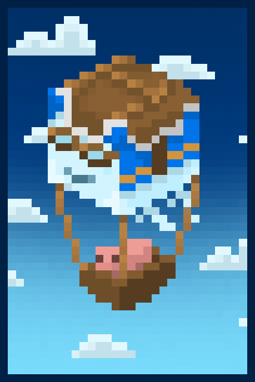</td></tr><tr><td align="center"><mark style="color:yellow;"><strong>Happy Ghast in The Night</strong></mark></td><td align="center">3x2</td><td align="center">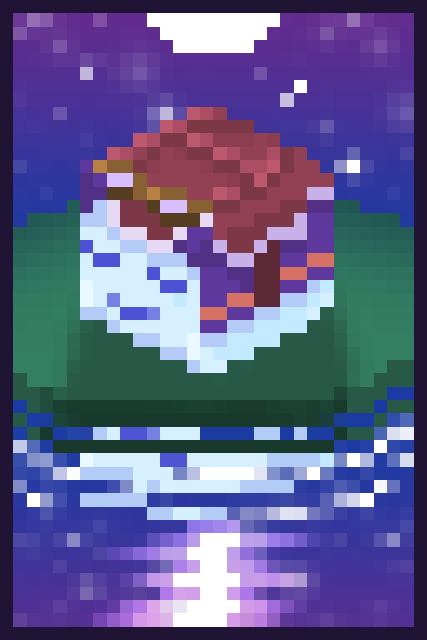</td></tr><tr><td align="center"><mark style="color:yellow;"><strong>Happy Ghast at Sunset</strong></mark></td><td align="center">3x2</td><td align="center">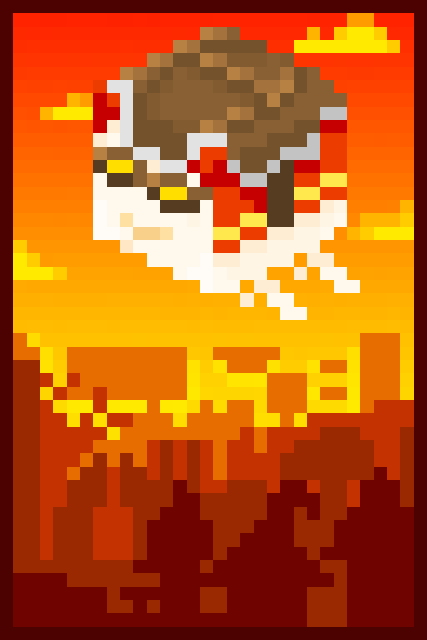</td></tr><tr><td align="center"><mark style="color:yellow;"><strong>Happy Ghast at Sunrise</strong></mark></td><td align="center">3x2</td><td align="center">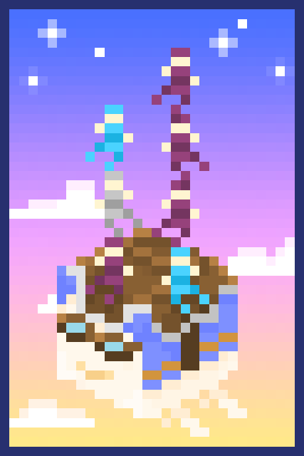</td></tr><tr><td align="center"><mark style="color:yellow;"><strong>99% of Miners Quit Before They Hit It Big</strong></mark></td><td align="center">3x3</td><td align="center">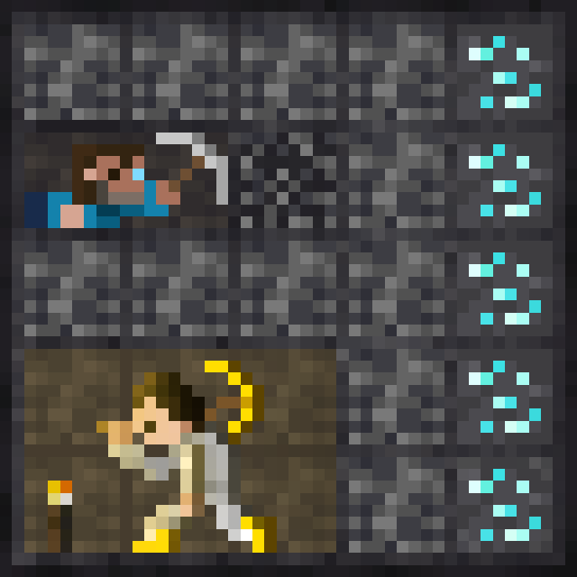</td></tr><tr><td align="center"><mark style="color:yellow;"><strong>It's a Bee</strong></mark></td><td align="center">1x1</td><td align="center">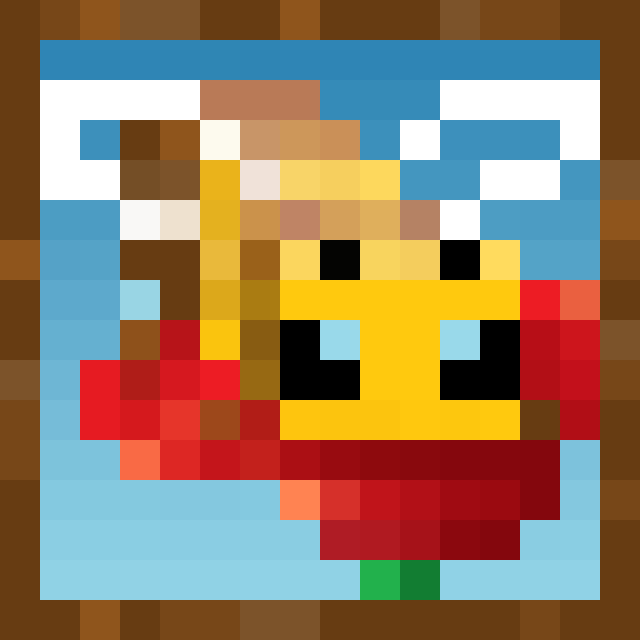</td></tr><tr><td align="center"><mark style="color:yellow;"><strong>Life Gaze</strong></mark></td><td align="center">2x3</td><td align="center">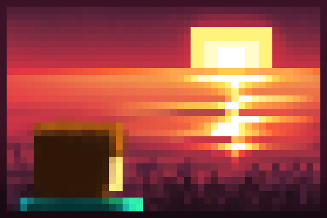</td></tr><tr><td align="center"><mark style="color:yellow;"><strong>The Coral Cabana Islands</strong></mark></td><td align="center">2x4</td><td align="center">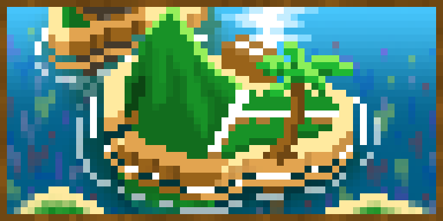</td></tr><tr><td align="center"><mark style="color:yellow;"><strong>Riding Through the Plains</strong></mark></td><td align="center">2x3</td><td align="center">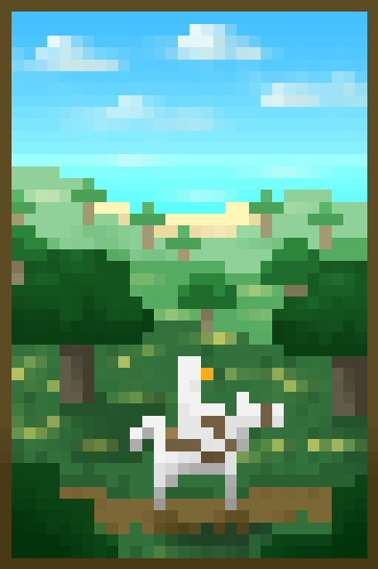</td></tr><tr><td align="center"><mark style="color:yellow;"><strong>Riding Through the Mesa</strong></mark></td><td align="center">2x3</td><td align="center">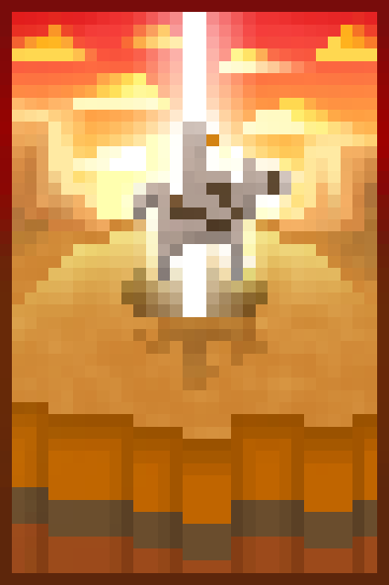</td></tr><tr><td align="center"><mark style="color:yellow;"><strong>Riding Through the Ocean</strong></mark></td><td align="center">2x3</td><td align="center">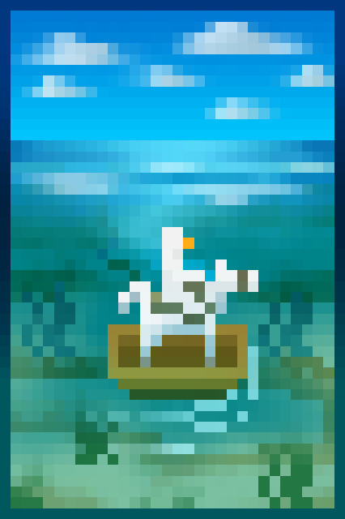</td></tr><tr><td align="center"><mark style="color:yellow;"><strong>Riding Through the Tundra</strong></mark></td><td align="center">2x3</td><td align="center">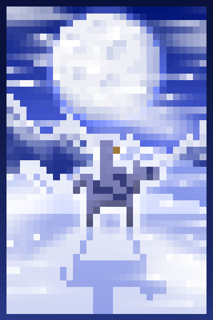</td></tr><tr><td align="center"><mark style="color:yellow;"><strong>It's a Black Cat</strong></mark></td><td align="center">1x1</td><td align="center">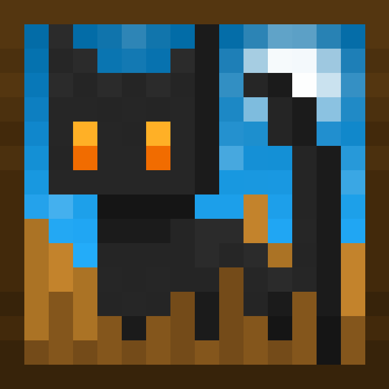</td></tr><tr><td align="center"><mark style="color:yellow;"><strong>It's an Allay</strong></mark></td><td align="center">1x1</td><td align="center">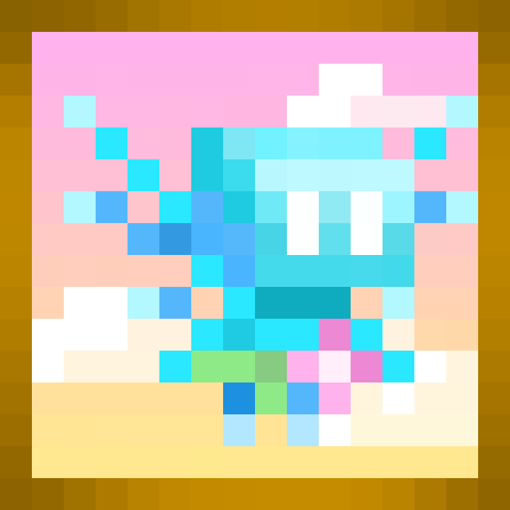</td></tr></tbody></table>

awesomelesbian (Alex)

|                               Name                              | Size |                         Image                        |
| :-------------------------------------------------------------: | :--: | :--------------------------------------------------: |
| <mark style="color:yellow;">**Whale Shark in The Water**</mark> |  1x3 | 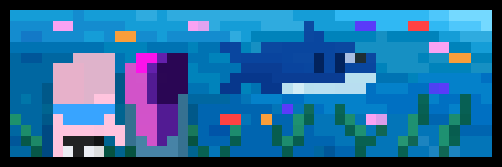 |

Ben Cactux

<table><thead><tr><th align="center">Name</th><th align="center">Size</th><th align="center">Image</th><th data-hidden data-type="files"></th></tr></thead><tbody><tr><td align="center"><mark style="color:yellow;"><strong>I’m Cubic</strong></mark></td><td align="center">2x2</td><td align="center">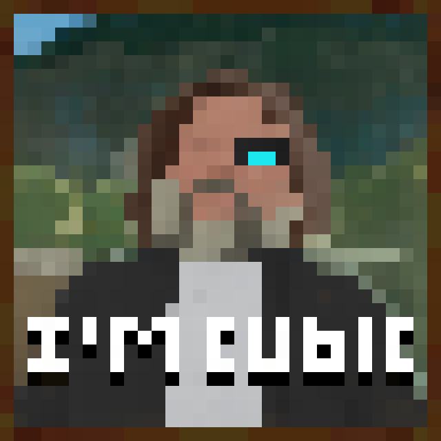</td><td><a href="/broken/files/e9wpKgB60WQMg9Yxbz1i">Broken link</a></td></tr><tr><td align="center"><mark style="color:yellow;"><strong>The Last Supper</strong></mark></td><td align="center">1x5</td><td align="center">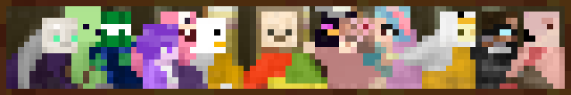</td><td><a href="/broken/files/oIz5HzcgTofN6CrCd656">Broken link</a></td></tr><tr><td align="center"><mark style="color:yellow;"><strong>Did We Just Save Christmas?</strong></mark></td><td align="center">2x3</td><td align="center">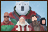</td><td><a href="/broken/files/KrjnzOPk1fy8lzRWoKw2">Broken link</a></td></tr><tr><td align="center"><mark style="color:yellow;"><strong>The Vitruvian Kev</strong></mark></td><td align="center">2x2</td><td align="center">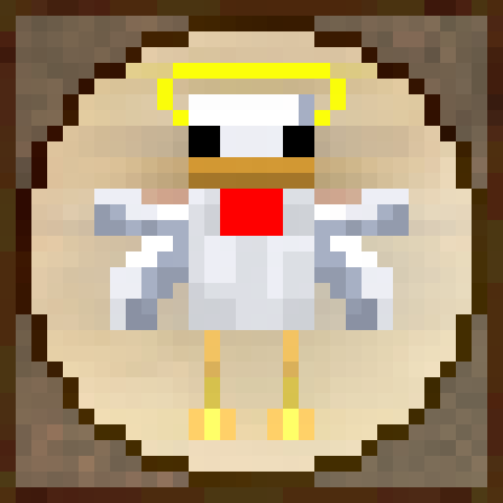</td><td><a href="/broken/files/ewf79UqODcg5vgNuhYH3">Broken link</a></td></tr></tbody></table>

Cesh

|                       Name                       | Size | Image                                 |
| :----------------------------------------------: | :--: | ------------------------------------- |
| <mark style="color:yellow;">**Cow Plush**</mark> |  3x3 | 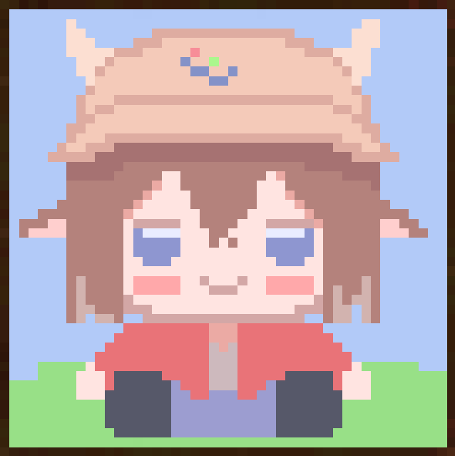 |

Cubic7

|                     Name                     | Size | Image                             |
| :------------------------------------------: | :--: | --------------------------------- |
| <mark style="color:yellow;">**Shiny**</mark> |  2x2 | 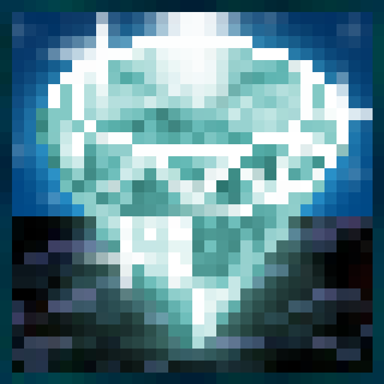 |

DarkBacon

|                          Name                         | Size | Image                                      |
| :---------------------------------------------------: | :--: | ------------------------------------------ |
| <mark style="color:yellow;">**Eggs and Bakey**</mark> |  2x1 | 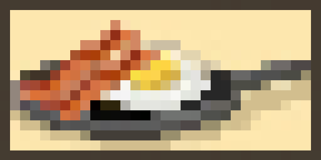 |
|     <mark style="color:yellow;">**Map Art**</mark>    |  1x1 | 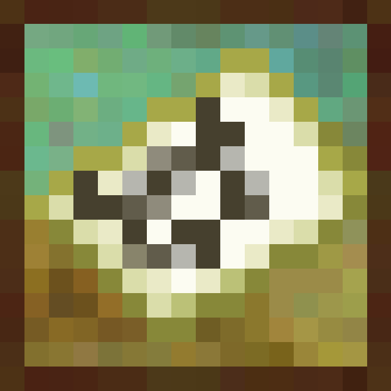        |

DDay Skeleton

<table data-full-width="false"><thead><tr><th align="center">Name</th><th align="center">Size</th><th align="center">Image</th><th data-hidden data-type="files"></th></tr></thead><tbody><tr><td align="center"><mark style="color:yellow;"><strong>Chuck's Ultimatum</strong></mark></td><td align="center">1x1</td><td align="center">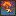</td><td><a href="/broken/files/rFNrg6skkZJv7epm5yIg">Broken link</a></td></tr><tr><td align="center"><mark style="color:yellow;"><strong>Slinky</strong></mark></td><td align="center">2x1</td><td align="center">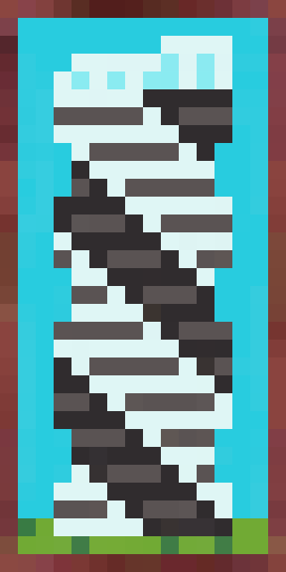</td><td><a href="/broken/files/HuX9KzeHlajhjIhcgsFR">Broken link</a></td></tr><tr><td align="center"><mark style="color:yellow;"><strong>Sly's Revenge</strong></mark></td><td align="center">2x1</td><td align="center">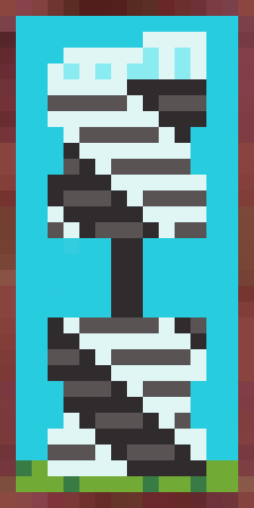</td><td><a href="/broken/files/K271oGvRBPIYObRxEPcC">Broken link</a></td></tr><tr><td align="center"><mark style="color:yellow;"><strong>Violent Overgrowth</strong></mark></td><td align="center">3x3</td><td align="center">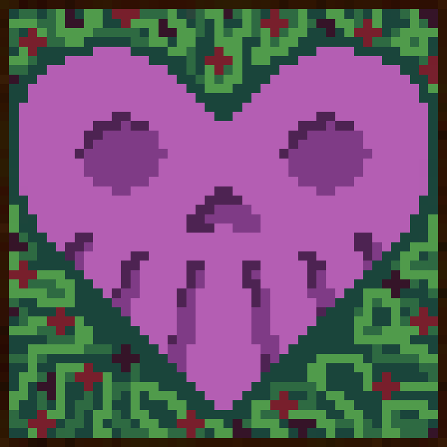</td><td><a href="/broken/files/rQPyYMreIP9FOQiAlEP5">Broken link</a></td></tr></tbody></table>

Eleven

|                           Name                           | Size | Image                                        |
| :------------------------------------------------------: | :--: | -------------------------------------------- |
|   <mark style="color:yellow;">**I Nominate You**</mark>  |  2x2 | 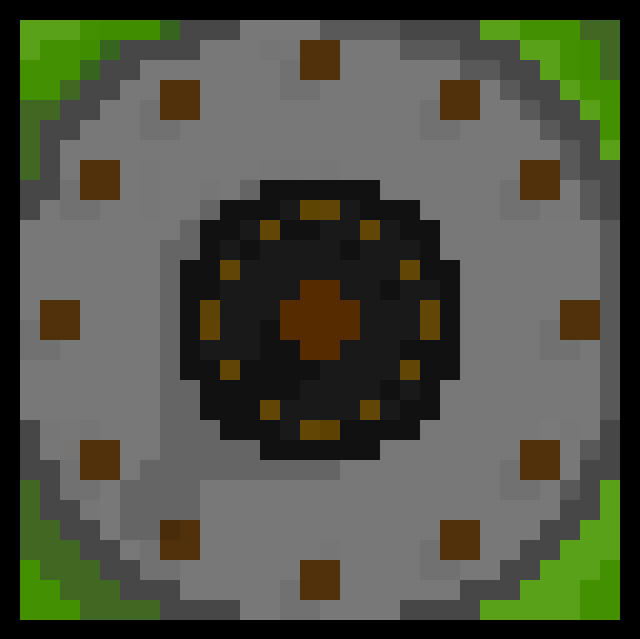   |
| <mark style="color:yellow;">**Spawn c. 11 07 25**</mark> |  4x4 | 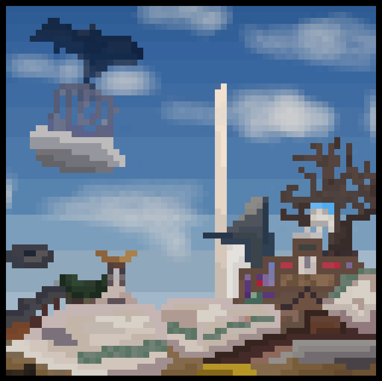 |

Frodo Tim Baku

<table><thead><tr><th align="center">Name</th><th align="center">Size</th><th align="center">Image</th><th data-hidden data-type="files"></th></tr></thead><tbody><tr><td align="center"><mark style="color:yellow;"><strong>Holy Duo</strong></mark></td><td align="center">4x3</td><td align="center">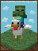</td><td><a href="/broken/files/uAcOjWusdCowCkuypG0y">Broken link</a></td></tr><tr><td align="center"><mark style="color:yellow;"><strong>Cabin Memories</strong></mark></td><td align="center">1x2</td><td align="center">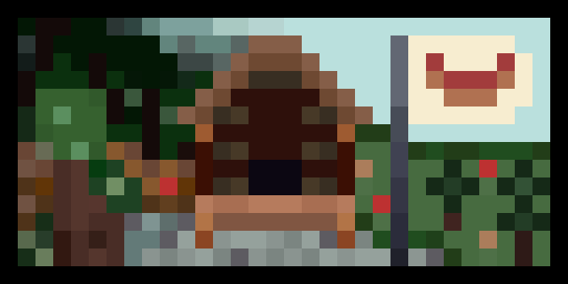</td><td></td></tr></tbody></table>

Kaalut

|                        Name                        | Size | Image                                   |
| :------------------------------------------------: | :--: | --------------------------------------- |
| <mark style="color:yellow;">**Hidden Gems**</mark> |  4x1 | 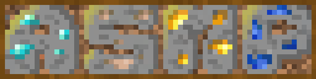 |

Kirstysoda

|                        Name                       | Size | Image                                  |
| :-----------------------------------------------: | :--: | -------------------------------------- |
| <mark style="color:yellow;">**Dark Night**</mark> |  1x1 | 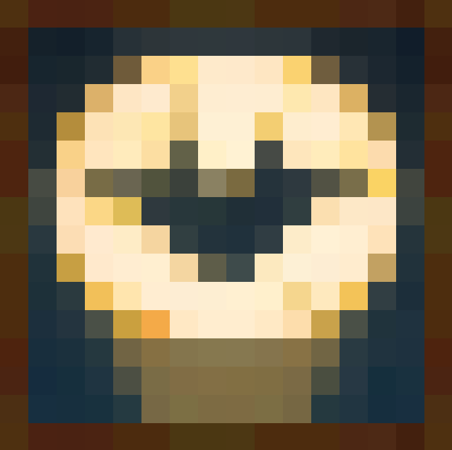 |

Leahbohbeah

|                             Name                             | Size |                       Image                       |
| :----------------------------------------------------------: | :--: | :-----------------------------------------------: |
|        <mark style="color:yellow;">**Kingdoms**</mark>       |  2x2 |        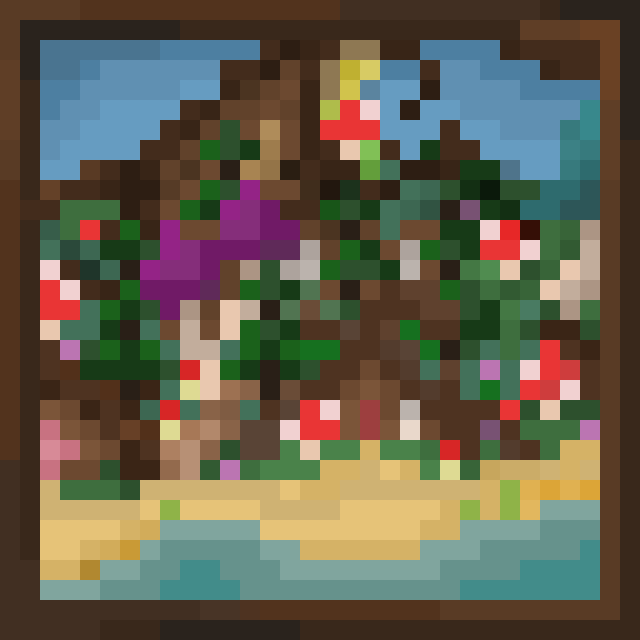       |
|  <mark style="color:yellow;">**What The Dogs Doin'?**</mark> |  2x3 |   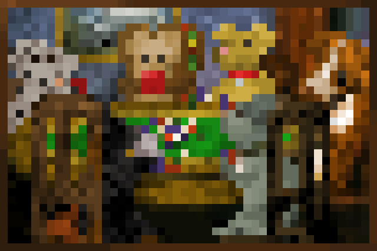  |
|       <mark style="color:yellow;">**Blackstone**</mark>      |  4x4 |       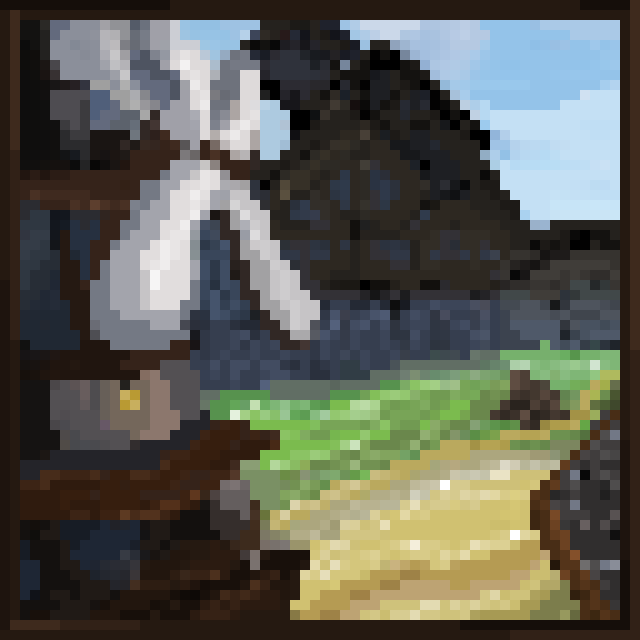      |
| <mark style="color:yellow;">**Afternoon in The Park**</mark> |  2x3 | 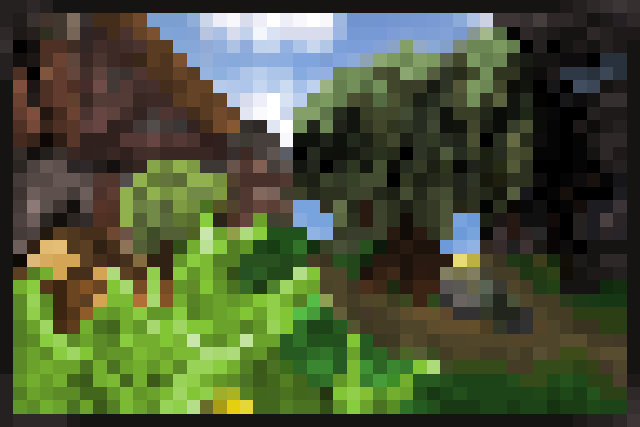 |
|      <mark style="color:yellow;">**Begin Again**</mark>      |  4x4 |      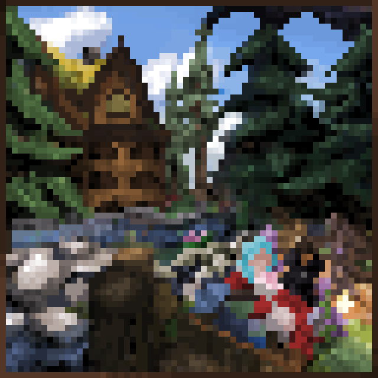      |

LibraH

|                          Name                          | Size | Image                                       |
| :----------------------------------------------------: | :--: | ------------------------------------------- |
| <mark style="color:yellow;">**Glizzy Comedian**</mark> |  1x1 | 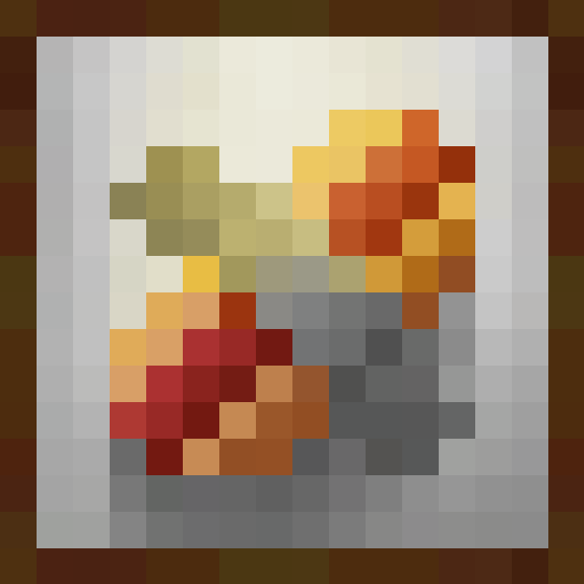 |

Oli

|                        Name                       | Size | Image                                  |
| :-----------------------------------------------: | :--: | -------------------------------------- |
| <mark style="color:yellow;">**Afterparty**</mark> |  4x4 | 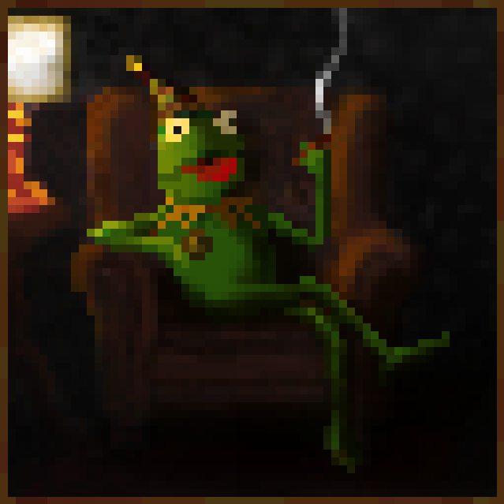 |

Plokie

|                        Name                       | Size | Image                                  |
| :-----------------------------------------------: | :--: | -------------------------------------- |
| <mark style="color:yellow;">**The Canals**</mark> |  4x2 | 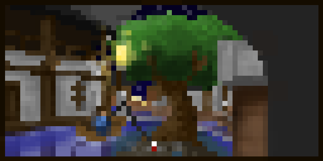 |

Radishonion

|                     Name                    | Size |               Image              |
| :-----------------------------------------: | :--: | :------------------------------: |
| <mark style="color:yellow;">**NOPE**</mark> |  3x2 | 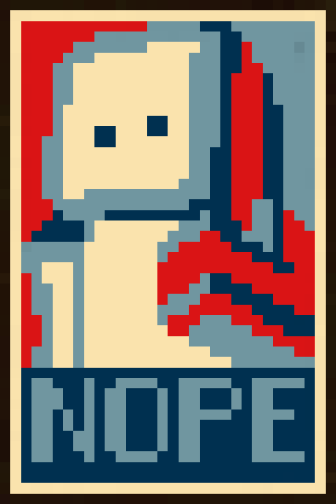 |

Sebm

|                       Name                      | Size | Image                                |
| :---------------------------------------------: | :--: | ------------------------------------ |
| <mark style="color:yellow;">**Big Blue**</mark> |  4x2 | 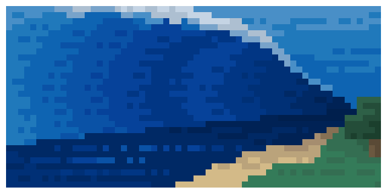 |

TGScowen

|                          Name                          | Size |                    Image                    |
| :----------------------------------------------------: | :--: | :-----------------------------------------: |
| <mark style="color:yellow;">**King Sea Pickle**</mark> |  1x1 | 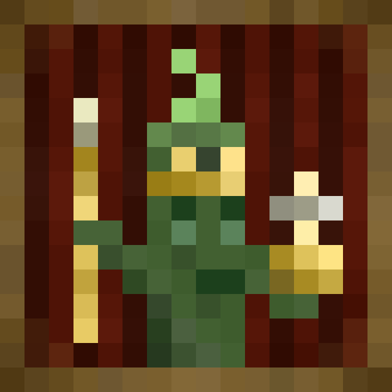 |

TJP_devil

|                        Name                       | Size |                  Image                 |
| :-----------------------------------------------: | :--: | :------------------------------------: |
| <mark style="color:yellow;">**The Future**</mark> |  4x4 | 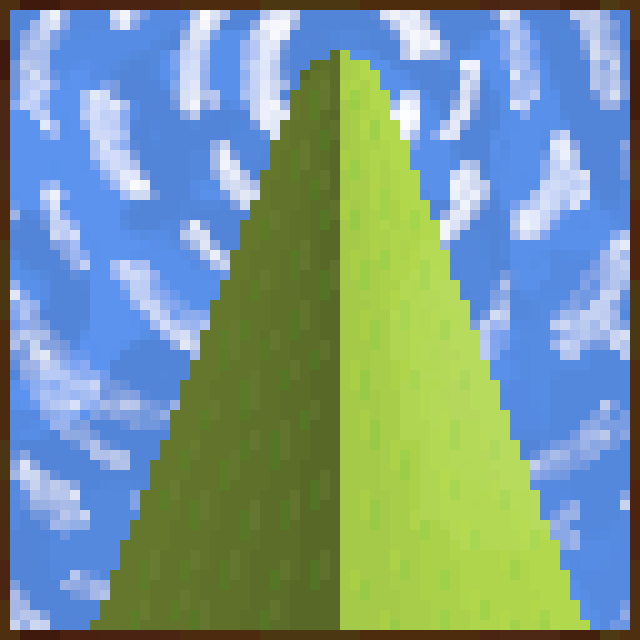 |

Username

|                                       Name                                      | Size | Image                                      |
| :-----------------------------------------------------------------------------: | :--: | ------------------------------------------ |
| <mark style="color:yellow;">**Alcoholic Bear (Who Needs One Last Shot)**</mark> |  4x3 | 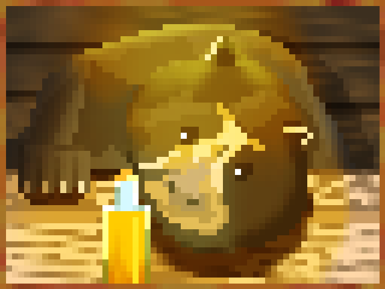 |

Yrense

|                            Name                            | Size | Image                                           |
| :--------------------------------------------------------: | :--: | ----------------------------------------------- |
|        <mark style="color:yellow;">**Glizzy**</mark>       |  2x3 | 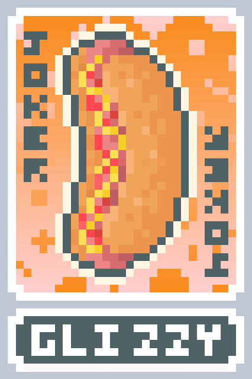              |
|    <mark style="color:yellow;">**Happy Birthday**</mark>   |  2x2 | 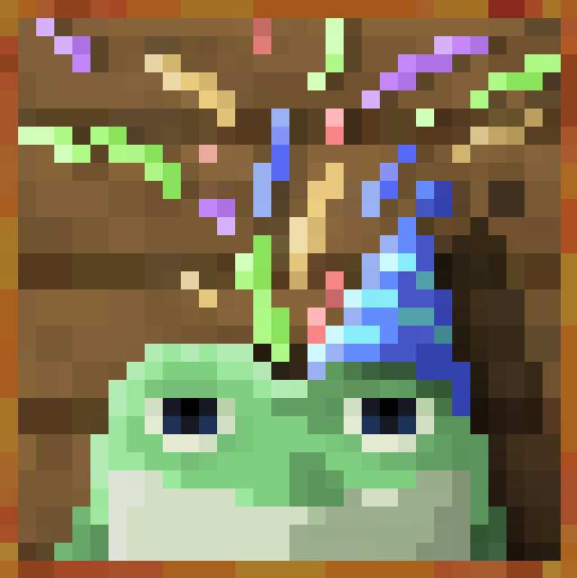      |
| <mark style="color:yellow;">**My Perfect Painting**</mark> |  4x4 | 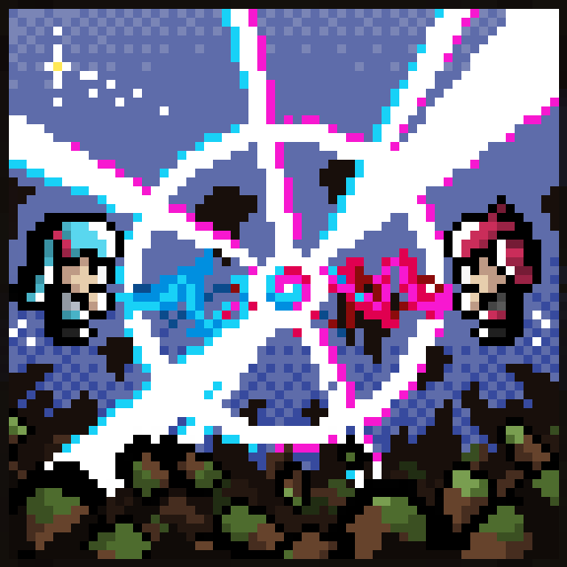 |

Yumatsu

|                          Name                         | Size |                  Image                 |
| :---------------------------------------------------: | :--: | :------------------------------------: |
| <mark style="color:yellow;">**The Duck Squad**</mark> |  2x4 | 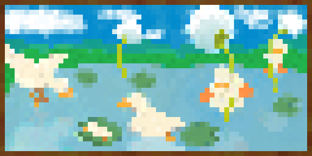 |

