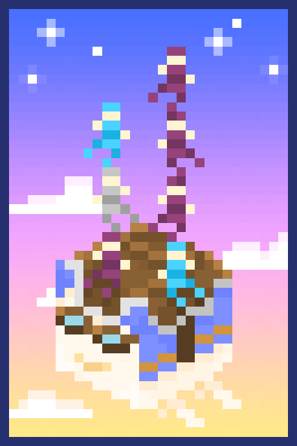
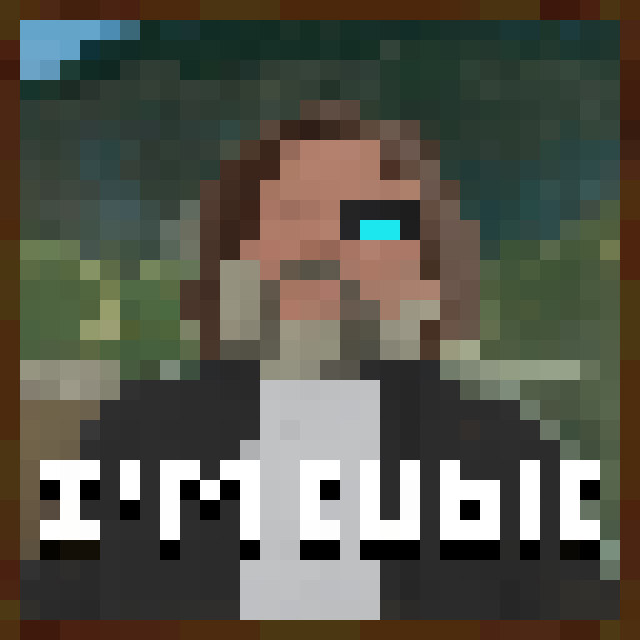
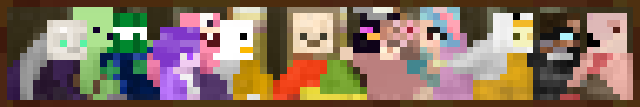
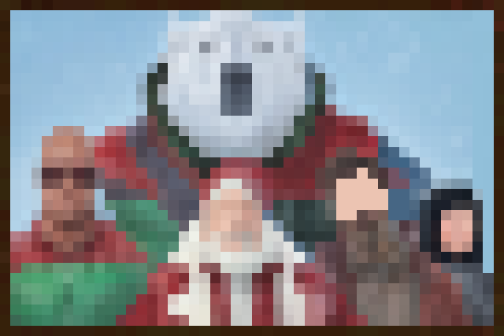
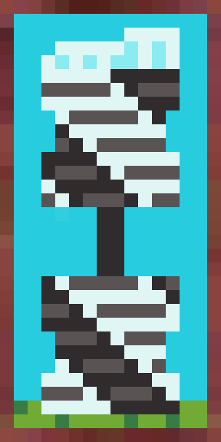

# Custom Paintings

A bunch of new painting related to the community have been added to the pool of possible paintings. Due to the pool of painting bringing additional rng element, you can use the Stonecutter to choose which painting you want without any rng element:

<figure><figcaption></figcaption></figure>

### List of Paintings By Author:

Anzhama

|                                       Name                                       | Size |                         Image                        |
| :------------------------------------------------------------------------------: | :--: | :--------------------------------------------------: |
|           <mark style="color:yellow;">**Happy Ghast in The Day**</mark>          |  3x2 |    |
|          <mark style="color:yellow;">**Happy Ghast in The Night**</mark>         |  3x2 |  |
|           <mark style="color:yellow;">**Happy Ghast at Sunset**</mark>           |  3x2 |     |
|           <mark style="color:yellow;">**Happy Ghast at Sunrise**</mark>          |  3x2 |    |
| <mark style="color:yellow;">**99% of Miners Quit Before They Hit It Big**</mark> |  3x3 |              |
|                 <mark style="color:yellow;">**It's a Bee**</mark>                |  1x1 |                 |
|                 <mark style="color:yellow;">**Life Gaze**</mark>                 |  2x3 |                 |
|          <mark style="color:yellow;">**The Coral Cabana Islands**</mark>         |  2x4 |  |

awesomelesbian (Alex)

|                               Name                              | Size |                         Image                        |
| :-------------------------------------------------------------: | :--: | :--------------------------------------------------: |
| <mark style="color:yellow;">**Whale Shark in The Water**</mark> |  1x3 |  |

Ben Cactux

<table><thead><tr><th align="center">Name</th><th align="center">Size</th><th align="center">Image</th><th data-hidden data-type="files"></th></tr></thead><tbody><tr><td align="center"><mark style="color:yellow;"><strong>I’m Cubic</strong></mark></td><td align="center">2x2</td><td align="center"></td><td><a href="broken-reference">Broken link</a></td></tr><tr><td align="center"><mark style="color:yellow;"><strong>The Last Supper</strong></mark></td><td align="center">1x5</td><td align="center"></td><td><a href="broken-reference">Broken link</a></td></tr><tr><td align="center"><mark style="color:yellow;"><strong>Did We Just Save Christmas?</strong></mark></td><td align="center">2x3</td><td align="center"></td><td><a href="broken-reference">Broken link</a></td></tr><tr><td align="center"><mark style="color:yellow;"><strong>The Vitruvian Kev</strong></mark></td><td align="center">2x2</td><td align="center"></td><td><a href="broken-reference">Broken link</a></td></tr></tbody></table>

DDay Skeleton

<table data-full-width="false"><thead><tr><th align="center">Name</th><th align="center">Size</th><th align="center">Image</th><th data-hidden data-type="files"></th></tr></thead><tbody><tr><td align="center"><mark style="color:yellow;"><strong>Chuck's Ultimatum</strong></mark></td><td align="center">1x1</td><td align="center"></td><td><a href="broken-reference">Broken link</a></td></tr><tr><td align="center"><mark style="color:yellow;"><strong>Slinky</strong></mark></td><td align="center">2x1</td><td align="center"></td><td><a href="broken-reference">Broken link</a></td></tr><tr><td align="center"><mark style="color:yellow;"><strong>Sly's Revenge</strong></mark></td><td align="center">2x1</td><td align="center"></td><td><a href="broken-reference">Broken link</a></td></tr><tr><td align="center"><mark style="color:yellow;"><strong>Violent Overgrowth</strong></mark></td><td align="center">3x3</td><td align="center"></td><td><a href="broken-reference">Broken link</a></td></tr></tbody></table>

Frodo Tim Baku

<table><thead><tr><th align="center">Name</th><th align="center">Size</th><th align="center">Image</th><th data-hidden data-type="files"></th></tr></thead><tbody><tr><td align="center"><mark style="color:yellow;"><strong>Holy Duo</strong></mark></td><td align="center">4x3</td><td align="center"></td><td><a href="broken-reference">Broken link</a></td></tr><tr><td align="center"><mark style="color:yellow;"><strong>Cabin Memories</strong></mark></td><td align="center">1x2</td><td align="center"></td><td></td></tr></tbody></table>

Leahbohbeah

|                             Name                             | Size |                       Image                       |
| :----------------------------------------------------------: | :--: | :-----------------------------------------------: |
|        <mark style="color:yellow;">**Kingdoms**</mark>       |  2x2 |               |
|  <mark style="color:yellow;">**What The Dogs Doin'?**</mark> |  2x3 |     |
|       <mark style="color:yellow;">**Blackstone**</mark>      |  4x4 |             |
| <mark style="color:yellow;">**Afternoon in The Park**</mark> |  2x3 |  |
|      <mark style="color:yellow;">**Begin Again**</mark>      |  4x4 |            |

Radishonion

|                     Name                    | Size |               Image              |
| :-----------------------------------------: | :--: | :------------------------------: |
| <mark style="color:yellow;">**NOPE**</mark> |  3x2 |  |

TGScowen

|                          Name                          | Size |                    Image                    |
| :----------------------------------------------------: | :--: | :-----------------------------------------: |
| <mark style="color:yellow;">**King Sea Pickle**</mark> |  1x1 |  |

TJP_devil

|                        Name                       | Size |                  Image                 |
| :-----------------------------------------------: | :--: | :------------------------------------: |
| <mark style="color:yellow;">**The Future**</mark> |  4x4 |  |

Yumatsu

|                          Name                         | Size |                  Image                 |
| :---------------------------------------------------: | :--: | :------------------------------------: |
| <mark style="color:yellow;">**The Duck Squad**</mark> |  2x4 |  |

