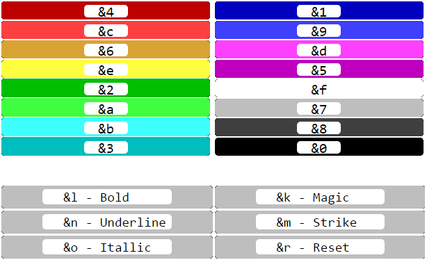

# Username Colors

You might have wondered: how do you get those cool colors in your name? The answer is the longer you play, the more colors you unlock to be able to put in your nickname. You can then use a special code to change the color of the words following it in your nickname. Here is the list of nickname color codes:

<figure><figcaption></figcaption></figure>

* 12 Hours - Dark Blue (&1) and Dark Aqua (&3),
* 24 Hours - Dark Red (&4) and Red (\&c),
* 3 Days - Gold (&6) and Yellow (\&e),
* 5 Days - Dark Gray (&8) and White (\&f),
* 7 Days - Dark Purple (&5) and Light Purple (\&d),
* 10 Days - Blue (&9) and Aqua (\&b),
* 12 Days - Dark Green (&2) and Green (\&a),
* 14 Days - RGB Colors ([https://www.birdflop.com/resources/rgb/](https://www.birdflop.com/resources/rgb/)),
* 30 Days - Strikethrough (\&m),
* Complete all ASMP advancements - Underline (\&n)

The default username color is Gray (&7)

You can also use these color when typing in chat or naming your waystone use these commands to use colors or the website listed above.

<figure><figcaption></figcaption></figure>

Example Command

<mark style="color:$success;">/nick</mark> <mark style="color:purple;">&4</mark><mark style="color:$success;">Cray</mark><mark style="color:purple;">\&d</mark><mark style="color:$success;">ola</mark><mark style="color:purple;">\&f</mark><mark style="color:$success;">Eater</mark><mark style="color:purple;">\&b</mark><mark style="color:$success;">27</mark>

<figure><figcaption></figcaption></figure>
