# Custom Recipes

Any recipe can be looked at in game by using <mark style="color:purple;">**/recipe**</mark>

## Woodcutter:

Various wood items can now be crafted through Stonecutter.

All Wood Types work like so:

<figure><figcaption></figcaption></figure> <figure><figcaption></figcaption></figure>

<figure><figcaption></figcaption></figure> <figure><figcaption></figcaption></figure>

<figure><figcaption></figcaption></figure>

Special Case for Bamboo since it has different blocks:

<figure><figcaption></figcaption></figure> <figure><figcaption></figcaption></figure>

<figure><figcaption></figcaption></figure> <figure>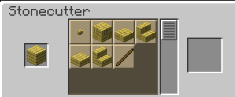<figcaption></figcaption></figure>

## Other Stonecutter changes:

Additions to the copper block recipes in stonecutter have been expanded to include doors and trapdoors.

Works with all versions of the copper block.

<figure><figcaption></figcaption></figure> <figure>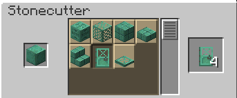<figcaption></figcaption></figure>

You can now place painting into the stonecutter to obtain any painting you want to get around the randomness of painting placement.

<figure><figcaption></figcaption></figure>

To learn more about custom paintings, visit page about [Custom Paintings](../customization/custom-paintings.md)&#x20;

## Non-Renewables:

Recipes that were added to bring a way for players to be able to obtain items which were limited indefinitely.




<figure><figcaption></figcaption></figure> <figure>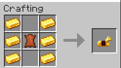<figcaption></figcaption></figure> <figure>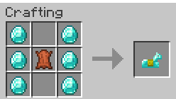<figcaption></figcaption></figure>





<figure>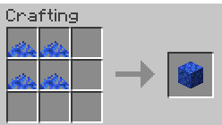<figcaption></figcaption></figure> <figure>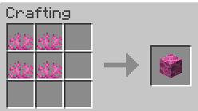<figcaption></figcaption></figure> <figure><figcaption></figcaption></figure> <figure><figcaption></figcaption></figure> <figure>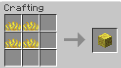<figcaption></figcaption></figure>




<figure>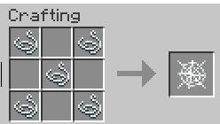<figcaption></figcaption></figure>



<figure><figcaption></figcaption></figure>



<figure>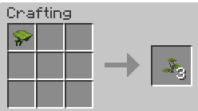<figcaption></figcaption></figure>



<figure>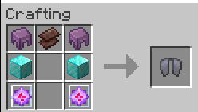<figcaption></figcaption></figure>



<figure>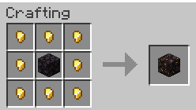<figcaption></figcaption></figure>



<figure><figcaption></figcaption></figure>



## Custom Horns:

Recipes which bring new life to the horns by adding the ability to craft horns with new sounds.

**Recipe Example:**

<figure>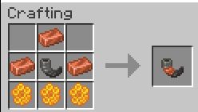<figcaption></figcaption></figure>

For more details on the Custom Horns, visit page about [Custom Horns](../customization/custom-horns.md)

## Custom Trims:

Trans Star Recipe which is used as a brand new material option for the Trims.

<figure><figcaption></figcaption></figure>

To learn more about the trims, visit page about [Custom Trims](../customization/custom-trims.md)

## Other:

Other custom recipes on the AtriocSMP



<figure>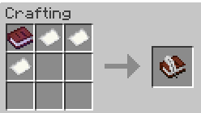<figcaption>
*The Book &#x26; Quill will not keep the text from the written book, used in the recipe*
</figcaption></figure>



<figure><figcaption>
*Drag onto an enchanted item to remove 1 random enchantment from it, consumed on use*
</figcaption></figure>




<figure><figcaption></figcaption></figure> <figure><figcaption></figcaption></figure>




