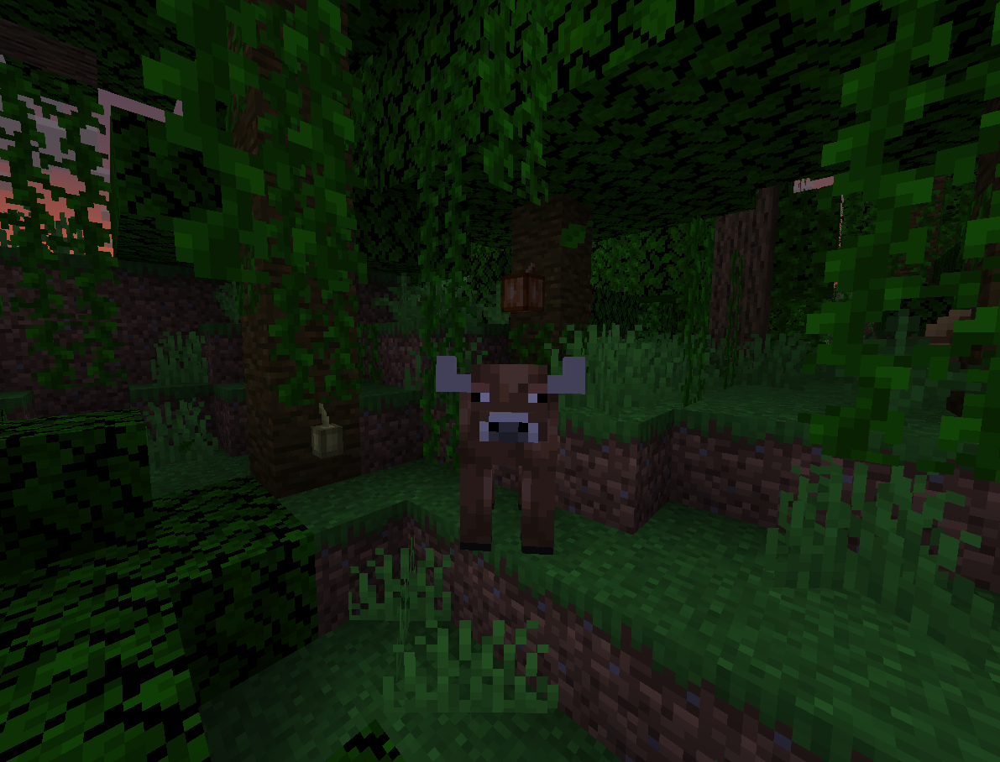
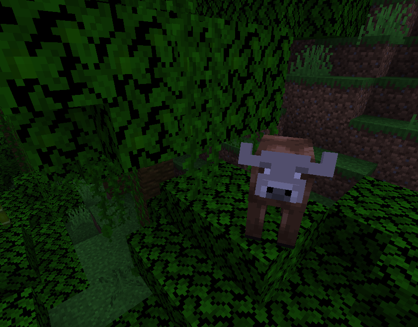
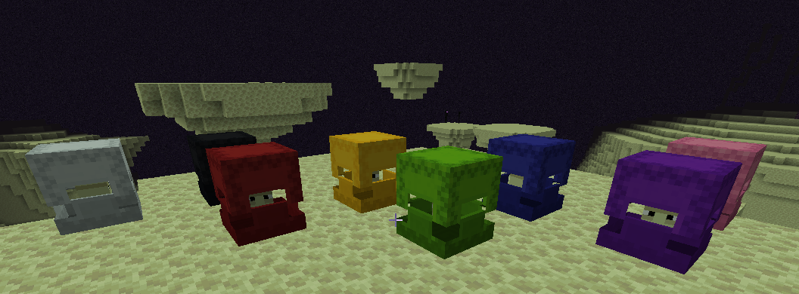

# Other Changes

## Spawning Changes:

In the Jungle you can  now spot a new rare variant of a cow called the Coffee Cow.

<figure><figcaption></figcaption></figure> <figure><figcaption>
*When Hit by Lightning, Coffee Cow Will turn into Mugged Cow, seen above*
</figcaption></figure>

Ocean Monuments now also spawn Elder guardians at 0.25% chance.

Bastions now spawn piglins with 0.25% to spawn piglin brutes instead.

## Shulker Redyeing:

When you punch a living shulker with a dye in hand, the dye is consumed and the shulker is dyed the corresponding color.

<figure><figcaption></figcaption></figure>

## Enchantment Changes:

Impaling enchantment has been adjusted to be more flexible for combat.

* Impaling now works on all mobs, not just aquatic
* Impaling now adds the same damage bonus like Sharpness

## Other Loot Table Changes:

* Jungle Leaves have been adjusted to reflect the same drop rates of saplings as other tree types
