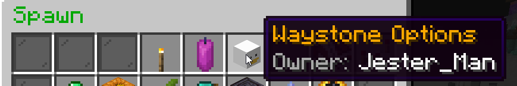
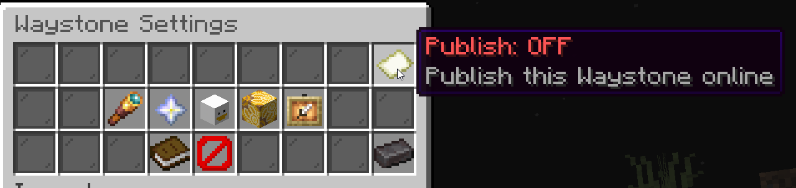
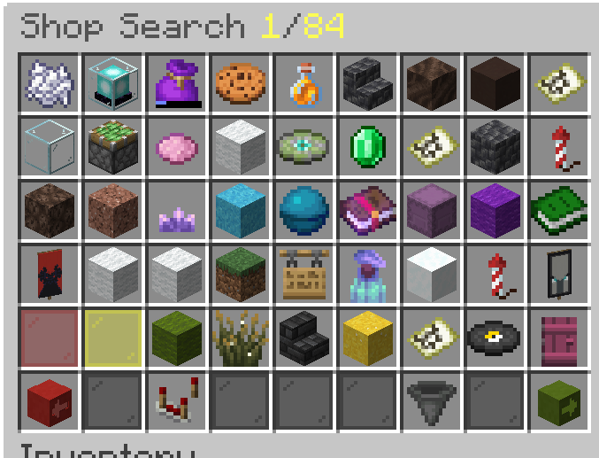
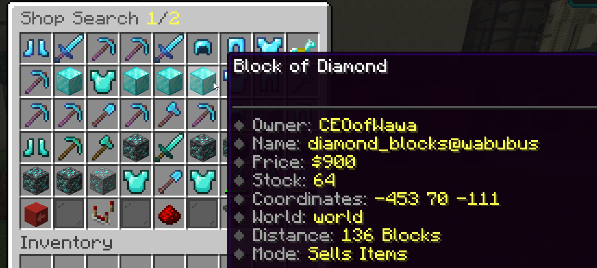
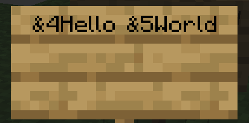
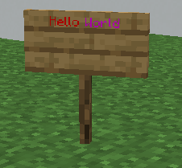
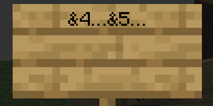
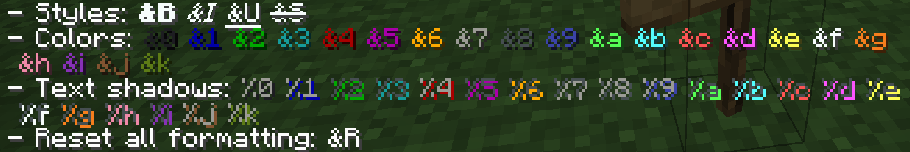
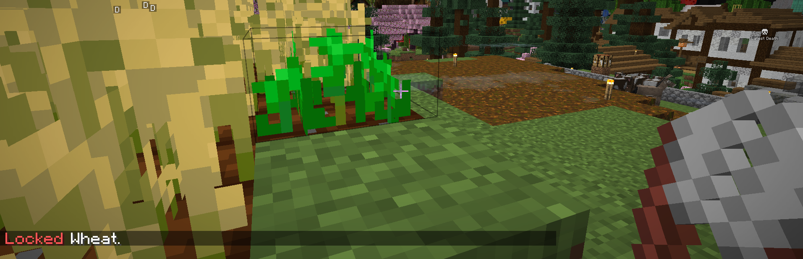

# QOL Plugin Update 4/20/2026

## Waystone Publishing

You can publish your Waystones to be publicly viewable on [https://asmp.cc/waystones](https://asmp.cc/waystones)

To publish a waystone, click your player head and then press the map. Waystones that are published are unbreakable until unpublished. You can also make a waystone unbreakable, without publishing it, by pressing the netherite ingot.

<figure><figcaption></figcaption></figure>

<figure><figcaption></figcaption></figure>

## Shop Searching

<figure><figcaption></figcaption></figure>

You can search through all shops in-game using **/shops**. Directly running that command brings up a browse menu, but there are also additional options for searching via commands. For example, to find all items that start with "diamond" on sale for up to 2000 glumbo, you can run:

**`/shopsearch -Max-Price 2000 diamond-?`**

You can also use `/qss` and `/shops` as command alternatives (they all do the same thing).

<figure><figcaption></figcaption></figure>

You can go extremely in depth with searches, especially when you combine flags (like -Max-Price) with predicates (like diamond-?). You can [learn more about the predicate system here.](https://blvckbytes.github.io/docs-item-predicate-parser/category/expression-syntax) Learn more about the plugin [here](https://blvckbytes.github.io/docs-quick-shop-search/).

## Colorful Signs

You can add color codes like &4 and \&a to signs:

<figure><figcaption></figcaption></figure>

Which makes the signs colorful!

<figure><figcaption></figcaption></figure>

If you right-click with a feather, you can condense the text to add even more formatting!

<figure><figcaption></figcaption></figure>

Each color costs dye, but once you use a dye once on a sign, you don't need that same dye again for that sign. When you break the sign, all the dyes will drop.

<figure><figcaption></figcaption></figure>

## Lockable Plants

* Can lock/unlock anything that grows with **shears**. Plants won't grow when locked
* Most harvestable crops can't be broken or trampled when locked
* Plants can't be bonemealed when locked, but they can be broken by other means (water, explosion)

<figure><figcaption></figcaption></figure>

Full list of lockable plants:

* Vertical Growing Plants (You only need to lock one of the connected plants in the column)
  * Sugar cane, cactus, bamboo, kelp
  * Twisting vines, Weeping vines, Vines
  * Cave vines (Glowberries can't be harvested when locked)
  * Chorus plants (only stops one chorus fruit at a time from growing, you'll need to lock each branch separately)
* Age-based crops and plants
  * Wheat, carrots, potatoes, beetroots (can't be broken or trampled)
  * Torchflower crop, pitcher crop (can't be broken or trampled)
  * Pumpkin stem, melon stem (stops fruit growing, but stems and fruit can still be broken (but not trampled!))
  * Sweet berry bush (can't be harvested or broken)
  * Nether wart, Cocoa (can't be broken)
* Sapling type plants
  * All tree saplings: oak, spruce, birch, jungle, acacia, dark oak, cherry
  * Azalea, flowering azalea, mangrove propagule
* Mushrooms (Stops mushrooms from spreading and growing into huge mushroom trees)
  * Red mushroom, brown mushroom
