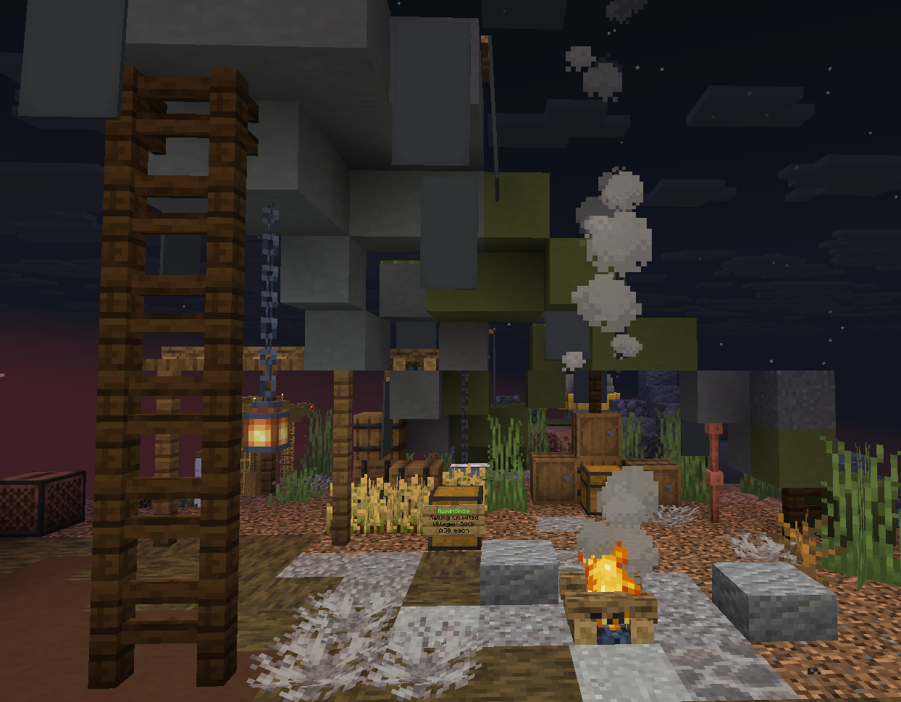
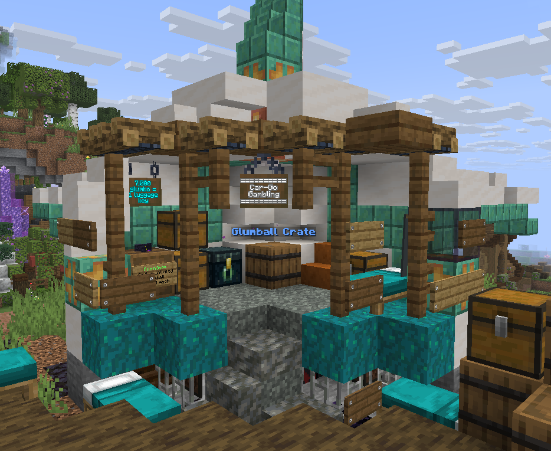
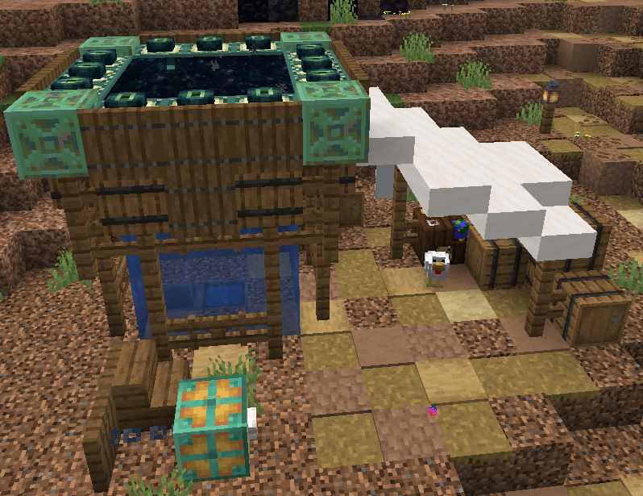
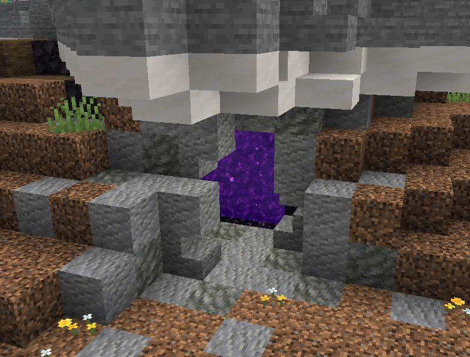

# Spawn Info

Banking

<mark style="color:orange;">Bank</mark> <mark style="color:$success;">(10, 22, -21)</mark>

<mark style="color:$info;">At the bank you can convert your diamonds into glumbo or glumbo into diamonds, glumbo is what you need to buy from most player shops and admin shops. The transfer rate is 100 glumbo for one diamond.</mark>

<mark style="color:$info;">-</mark> <mark style="color:$info;"></mark>_<mark style="color:$info;">For more information see the page about our custom currency</mark>_ [<mark style="color:blue;">**Glumbocoins**</mark>](server-mechanics/glumbocoins.md)

<figure><figcaption></figcaption></figure>

Spawn Shops

<mark style="color:orange;">Sand & Sponge</mark> <mark style="color:$success;">(-24, 86, -53)</mark>\
<mark style="color:$info;">This is an admin shop for sponge and sand, it never runs out. Sand is 0.50 Glumbo each and sponges are 100 Glumbo Each</mark>\

<figure><figcaption></figcaption></figure>

<mark style="color:orange;">Waystones & Swift Sneak 3</mark> <mark style="color:$success;">(-60, 84, -80)</mark>\
<mark style="color:$info;">Waystones are how you teleport around the map they are sold here for 10,000 glumbo (</mark><mark style="color:purple;">/kit firstwaystone</mark> <mark style="color:$info;">to get your first one for half off)</mark>\ <mark style="color:$info;">Swift Sneak 3 enchant book is sold here for 7,500 glumbo</mark>

<figure><figcaption></figcaption></figure>

<mark style="color:orange;">Villager books</mark> <mark style="color:$success;">(-34, 86, -5)</mark>\ <mark style="color:$info;">Villager books are the books you need to trade with villagers to get enchant books, they are sold here for 50 glumbo each -</mark> <mark style="color:$info;"></mark>_<mark style="color:$info;">For more information see the page about</mark>_ [<mark style="color:blue;">**Villager Trading**</mark>](server-mechanics/villager-trading.md)

<figure><figcaption></figcaption></figure>

<mark style="color:orange;">Glumball Crate</mark> <mark style="color:$success;">(-41, 87, -66)</mark>\ <mark style="color:$info;">For 7000 Glumbo you can purchase a luggage key to then use on the crate to have a chance to obtain various items! -</mark> <mark style="color:$info;"></mark>_<mark style="color:$info;">For more information see the page about our custom currency</mark>_ [<mark style="color:blue;">**Glumbocoins**</mark>](server-mechanics/glumbocoins.md)

<figure><figcaption></figcaption></figure>

<mark style="color:orange;">End Portal</mark> <mark style="color:$success;">(-68, 80, -32)</mark>\ <mark style="color:$info;">The only End Portal on the server is located at spawn for convenient access.</mark>

<figure><figcaption></figcaption></figure>

<mark style="color:orange;">Nether Portal</mark> <mark style="color:$success;">(-9, 80, -52)</mark>\ <mark style="color:$info;">Spawn Nether portal under the wing leading to the Server Nether Hub.</mark>

<figure><figcaption></figcaption></figure>
