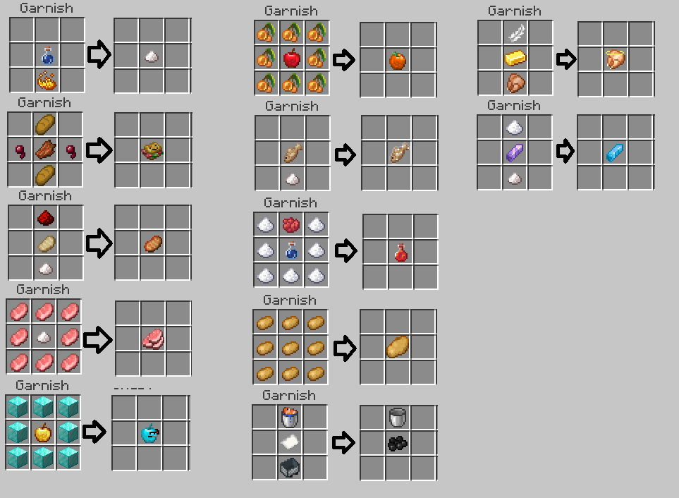

# April Fools

Every Year we try to celebrate the April Fool's with our community, below you can find details on our previous April Fool's events.

### THE GRUBS & GARNISH UPDATE (2025)

Patch Notes

Here at the **ASMP**, we have always strived to foster a place of innovation and creation. And Mojang has recognized that. I am excited to announce that because of that we have engaged in **a partnership** and received the **alpha version of their next major update**. For the **next four hours** this version will be **active on the server**, bringing with it new **grubs**, a **garnishing table**, a and more new features! It’s time to be wary of the mines, for if you venture in there is now a chance of **contacting a grub**. Grubs give several different negative effects to the player and are **permanently fused** until you visit your **local doctor**. Use the new **Garnishing table** to create **new delectable food options** with countless effects. Stay vigilant though, it’s impossible to know what kind of creatures could show up in this new update, everything is on the table!

### PATCH NOTES

Added Grubs



* Drops Garnishing Table when killed by a player
* Spawns on players below Y lvl 0
* Upon spawning gives Grub Effects to players
  * Grub Effects are permeant negative effects
  * Are not removed by death
  * May only be removed by visiting a Doctor on the server

Added Garnishing Table


* Only obtainable via Grub Drops
* New Garnished Food can be crafted by placing items in the correct pattern on the table

Added Garnished Food

* 12 New Items that are exclusively crafted on the new Garnishing Table
* These items give special status effects when consumed

Removed 𝕏 the Everything Monster

<figure><figcaption></figcaption></figure>

Downloadables:





### THE BUNDLES OF BRAINROT UPDATE (2026)

Patch Notes

Fishing Changes

* Updated Wooden Fishing Rod loot pool
* Added New Fishing Rod Variant’s for Copper, Iron, Gold, Amethyst, Emerald, Diamond, Netherite & Chungite
* Added Progression System for obtaining the new Tiered Fishing Rods
* Aquatic Mobs are now fished out while still being alive
* Added Tiered Loot Crates with variants for each Fishing Rod Tier



New Enchantments

* Added 22 New Enchantments
* New Enchantments have replaced Old Enchantments in Fishing Loot Tables

* New Enchantments can be found in Enchantment Table


New Ore

* Added New Chungite Ore Family
- Raw Chungite is obtained by farming carrots
* Added New Chungite Tool Variants for Sword, Pickaxe, Axe, Hoe, Shovel, and Mace
* Chungite Tools are obtained by using a Chungite Ingot with a Chungite Upgrade Template on a Netherite Tool
* Added Chungite Upgrade Template
* Added 1 Durability Chungite & Steel

New Mobs


* Added Ping Rays to roam the ocean depths
* Added a New Big Chungus Boss that drops Chungite Upgrade Template
* Added a New Drowned Scurvy King Boss
* Added new Craftable Groundhogs

Glumboxes

* New Glumboxes can be obtained from Fishing
* Glumbox odds scale with Loot Crate Tiers
* Upon breaking, Glumboxes trigger one of 20 events


Healthcare

* Added new Doctor Villager Profession

* Added Syringes to the game
* Added new Healing Items



Miscellaneous

* Removed Locking Chests
* Added Brainrot Effect
* Added New Exponential Meths
* Added Kickball
* Updated Lightning Rods
* Added Worms

* Netherite Scrap can now be Clumped Together
* Added the Knockout Suit
* Updated Portals

* Updated Overlay Textures

And this is just scratching the surface, there is so much more...

Downloadables:





