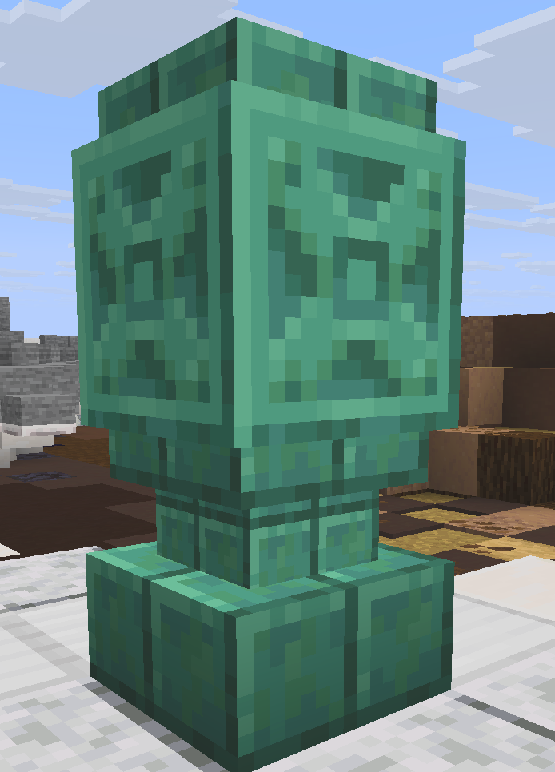

# Waystones (warping)

<figure><figcaption></figcaption></figure>

around the world you will find waystone like this right clicking these will add them to your waystones list and allow to teleport to and from this waystone in the future

<figure><figcaption></figcaption></figure>

Your waystone menu will look something like this as you find and collect more waystones their icon will appear in this menu clicking on the waystone icon will teleport you that waystone. (This teleport has a 3 second cooldown and breaking a block will stop your teleport)\
\
Right clicking on a waystone icon will hide it from your main menu, clicking the torch in the top left will turn on or off showing your hidden waystones. Right click a hidden waystone icon again to bring it back to the main gui.

Clicking the spyglass in the bottom middle will bring up a search option just type the name of the waystone you are looking for into the sign and it will bring it up

<figure><figcaption></figcaption></figure>

<figure><figcaption></figcaption></figure>

### Obtaining a waystone

You can get your first waystone for the price of 5,000 glumbo by doing <mark style="color:purple;">/kit firstwaystone</mark> any waystone after this must be [purchased at spawn. ](spawn-info.md)
